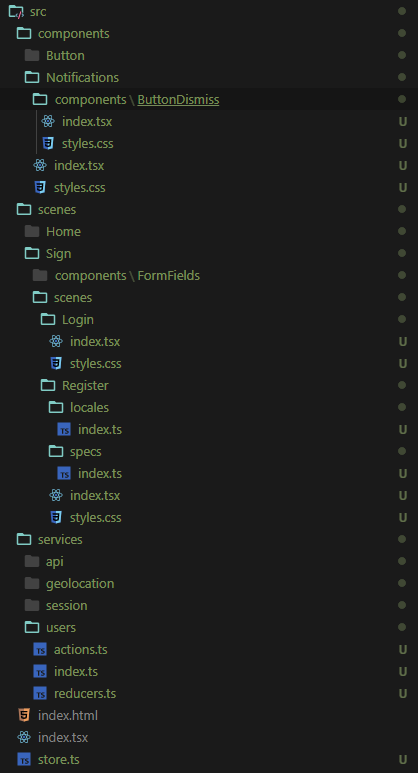

## 위 구조를 사용하기 위한 규칙들

-   components: 중첩된 component 또는 service를 정의 할 수 있다. 하지만 scene을 사용하거나 정의할 수 없다.
-   scenes: 중첩된 component, scene, service를 정의 할 수 있다.
-   services: service는 중첩된 service를 정의 할 수 있다. 하지만 component 및 scene을 사용하거나 정의 할 수 없다.
-   중첩된 기능은 상위에서만 사용할 수 있다.

*   "사촌" 관계인 기능은 사용할 수 없고 사용하기 위해서는 부모로 이동해서 사용해야 한다.

## Components

-   Components 폴더에 정의된 컴포넌트는 전역적으로 사용할 수 있다.
-   만약 중첩된 구성요소를 사용할 경우 중첩된 컴포넌트는 바로 상위에 있는 컴포넌트만 사용할 수 있다.

### 왜 이렇게 사용하는가?

대규모 어플리케이션을 개발 할 때 컴포넌트를 자주 만들어 사용하지만 재사용하기 어려운 경우가 있다. 최상위 수준에서 컴포넌트를
만들어 추가하게 되면 수백개의 컴포넌트들이 존재할 수 있는데 이런 컴포넌트들을 정리할 필요가 있다.

버튼, 썸네일 같은 컴포넌트만 최상위 수준에서 존재하고 하위 수준에서 좀 더 복잡한 컴포넌트를 구현하면 항목들이 쉽게 정리가 된다.

ex) Notifications/components/ButtonDismiss

-   Notification은 어디서든 사용할 수 있다.
-   ButtonDismiss는 Notifications 외에 다른 곳에서는 사용할 수 없다.

**결과적으로 사용방식을 간단하게 하기 위해서 이런 구조를 택한 것 같다.**

## Scenes

-   페이지 컴포넌트

Scene 을 사용하는 것도 컴포넌트와 마찬가지로 상위 요소만 사용가능하고 중첩된 요소는 사용하지 못한다.

ex) scenes/Home, scenes/Sign

-   `scenes/Home` 에는 ButtonLike 컴포넌트가 있는데 Home에서만 사용가능하다.
-   `scenes/Sign` 에는 FormFields 컴포넌트가 있는데 Sign에서만 사용가능하다.
-   `scenes/Sign/scenes/Login/components/Form` 에는 `scenes/Sign/components/ButtonLike` 를 사용할 수 있다.
-   하지만 `scenes/Sign/scenes/Register` 에서는 `scenes/Sign/scenes/Login/components` 를 사용할 수 없다.

## Services

-   특정 컴포넌트 또는 Scene에서 사용할 수 있는 독립적인 모듈을 가진다.
-   핵심 비지니스 로직을 정의가 포함된 모듈.
-   여러 Scene 같은 곳에 공유될 수 있다.

### Api

-   Api와 Scene, 컴포넌트 사이의 브릿지/ 어댑터로 사용하는 Api 요청을 관리하는 모듈을 만드는 것이 좋다.

## 결론

-   관련된 엔터티를 함께 그룹화 하는 것이 작업을 하는데 있어 훨씬 간단하고 쉬워졌다.
-   중첩된 폴더 수를 3 ~ 4 수준으로 제한 하는 것이 좋음. 이렇게 하면 복잡성을 피하고 코드의 재사용 성을 극대화 하는데
    도움이 됨.

## 내 결론

컴포넌트, Scene, 모듈 등을 사용하는데 있어 규칙을 정하는게 중요하고 특히 중첩된 컴포넌트 내에서 가져와서 사용하는 컴포넌트를
제한하는 내용이 사용성에 있어 좋다고 생각함.

## 참조

-   https://medium.com/@alexmngn/how-to-better-organize-your-react-applications-2fd3ea1920f1
